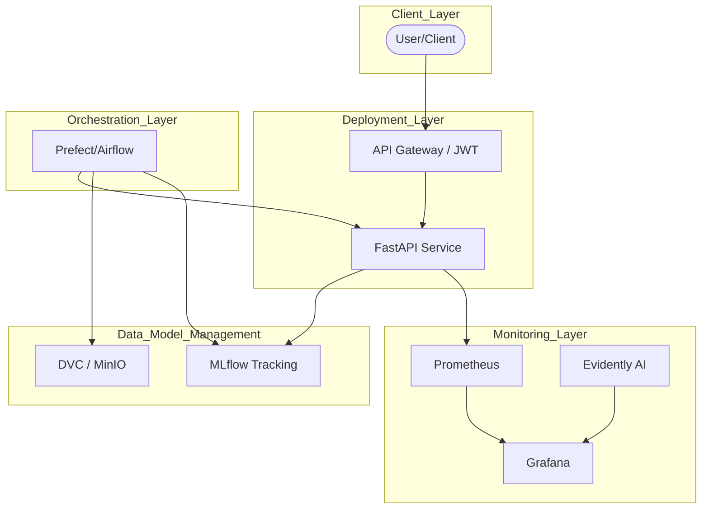

# MLOps Project Template

This repository provides a professional structure and a step-by-step methodology for industrializing Machine Learning projects.

## 🏗 Project Architecture



## 🚀 Quick Start

### 1. Prerequisites
- [UV](https://astral.sh/uv) (Fast Python package manager)
- [Docker & Docker Compose](https://docs.docker.com/)

### 2. Installation
```bash
# Clone the repo
git clone <your-repo-url>
cd mlops-project

# Sync dependencies
uv sync
uv sync --extra dev
```

### 3. Running the project
This project is built progressively. Depending on your current phase:

- **Phase 1 (API only):**
  ```bash
  docker-compose up api -d
  ```
- **Phase 2-4 (Full Stack):**
  ```bash
  docker-compose up -d
  ```

## 📖 Methodology & Roadmap

The project is designed to be built in 4 iterative phases. For a detailed step-by-step guide, please refer to the documentation:

- 🇫🇷 [French Version](./docs/00_project_methodology_fr.md)
- 🇬🇧 [English Version](./docs/00_project_methodology_en.md)

## 📂 Project Structure Recap
- `api/`: FastAPI inference code.
- `src/`: Core ML logic and library code.
- `deployment/`: Infrastructure configs (Prometheus, Grafana).
- `docker/`: Dockerfiles for different services.
- `configs/`: Project framing and Hydra configurations.
- `data/`: DVC managed data folders.
